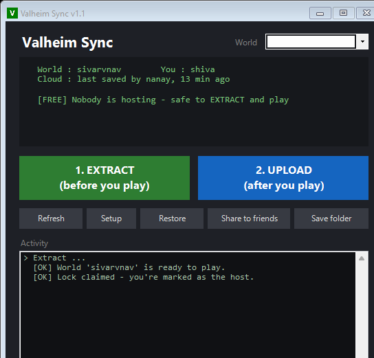

# Valheim Sync

Share one Valheim world with friends — **no host needs to stay online**.
The world lives in **Backblaze B2** (cloud) between sessions. Whoever wants to
play **EXTRACTs** the latest world, hosts in-game as normal, then **UPLOADs** it
back when finished. The next person does the same.

A "lock" stored in the cloud tracks whose turn it is, so two people don't host
from stale copies and split the world into two diverging timelines.

## Download

Grab the latest zip from the [**Releases**](../../releases/latest) page, unzip
it anywhere, and double-click `Valheim Sync.vbs`. `rclone` downloads itself on
first run; then click **Setup** to connect your Backblaze bucket. (No
`config.json` ships in the download — you create yours in Setup.)

## How to use it — just one file

Double-click **`Valheim Sync.vbs`**. That opens the app — a window with
everything you need:

- **EXTRACT** (green) — download the latest world before you play
- **UPLOAD** (blue) — save the world back to the cloud when you're done
- **World dropdown** (top-right) — switch which world the group syncs, if you
  keep more than one going
- **Setup** — paste your Backblaze bucket + key (first time only); also adds a
  Desktop shortcut and lets you set an optional Discord webhook
- **Restore** — roll the world back to any earlier save (pick from a list)
- **Share to friends** — builds a zip on your Desktop to send to friends
- **Refresh** / **Save folder** — check status, open the Valheim saves folder

The app **checks GitHub for updates** on launch and offers to update itself when
a new version is released, so you don't have to re-send the zip every time.

The status panel at the top shows who hosted last and whether anyone is
currently hosting. Pop-up warnings appear if something looks off — e.g. if the
cloud world is newer than yours (you'd overwrite someone), or if you'd take over
a session someone else still has.

(The `.ps1` files are the engine — you never click those. `Valheim Sync.vbs`
is the only thing you open.)

### Discord notifications (optional)
In **Setup**, paste a Discord webhook URL (Server Settings → Integrations →
Webhooks → New Webhook → Copy URL). The group then gets a ping when someone
**starts hosting** (🔴) and when the world is **free again** (🟢) — so nobody
plays on top of someone else. The same URL is shared in the friends zip, so
everyone posts to the same channel.

### Abandoned sessions
If someone Extracts and never Uploads (crash, went to bed), their host lock is
treated as **abandoned after 6 hours** and anyone can take over without the
scary warning. Change the window via `LockStaleHours` in `config.json`.

---

## Got this from GitHub?

There's no `config.json` in the repo on purpose — it holds a private Backblaze
key and is git-ignored. To get started, either:

- **Just run Setup** — open `Valheim Sync.vbs`, click **Setup**, and it writes a
  fresh `config.json` for you, **or**
- **Copy the template** — rename `config.example.json` to `config.json` and fill
  in your own values.

`rclone` is downloaded automatically on first run, so there's nothing else to
install.

---

## One-time setup (do this once, by one person)

1. **Make the Backblaze bucket + key**
   - Sign up free at <https://www.backblaze.com/cloud-storage> (10 GB free).
   - **Buckets → Create a Bucket**, set it **Private**, copy the bucket name.
   - **Application Keys → Add a New Application Key** restricted to that bucket,
     and copy the **keyID** and **applicationKey** (the key shows only once).
2. **Open the app** (`Valheim Sync.vbs`) → click **Setup** → paste the bucket,
   keyID, and applicationKey. It downloads `rclone` and tests the connection.
3. **Seed the world** → click **UPLOAD** once to put your world in the cloud.
4. **Share** → click **Share to friends**, then send the
   `ValheimSync-for-friends.zip` from your Desktop to your friends. They unzip
   it and double-click `Valheim Sync.vbs` — no setup on their end.

> The `config.json` carries your B2 key, so only share the zip with people you
> trust to play on the world. Use a key restricted to just this bucket.

---

## Everyday use

1. **Before you play:** click **EXTRACT** → start Valheim → host the world.
2. **When you're done:** fully close Valheim → click **UPLOAD**.

That's the whole loop. Click **Refresh** any time to see who's hosting.

## Golden rules (tell your friends)
1. **EXTRACT before you play, UPLOAD after you play.** Always both.
2. **Only one person hosts at a time.** The status panel shows the lock —
   coordinate on Discord; whoever holds it is "it".
3. **Close Valheim fully before UPLOAD/EXTRACT** (the save is locked while the
   game runs).
4. If someone forgets to UPLOAD, the next EXTRACT warns that the local copy
   looks newer — the person who actually played should UPLOAD first.

---

## Good to know
- Every UPLOAD keeps a timestamped copy under `valheim/<world>/history/` (use the
  **Restore** button to roll back). History is trimmed to the newest `HistoryKeep`
  saves (default 20) and old file versions are purged each upload, so the bucket
  stays small and well within B2's free tier.
- If the world you're about to UPLOAD is much smaller than the cloud copy, the app
  warns first — protection against uploading a wrong or corrupted world.
- A host lock older than `LockStaleHours` (default 6) is treated as abandoned, so a
  forgotten session never blocks the group.
- Each machine keeps its last 10 worlds in `local-backups/` here as a safety net.
- The shared world is set in `config.json` (`WorldName`) — or just use the **World**
  dropdown in the app.
- `rclone.exe` lives in `bin/` and is fetched automatically the first time.
